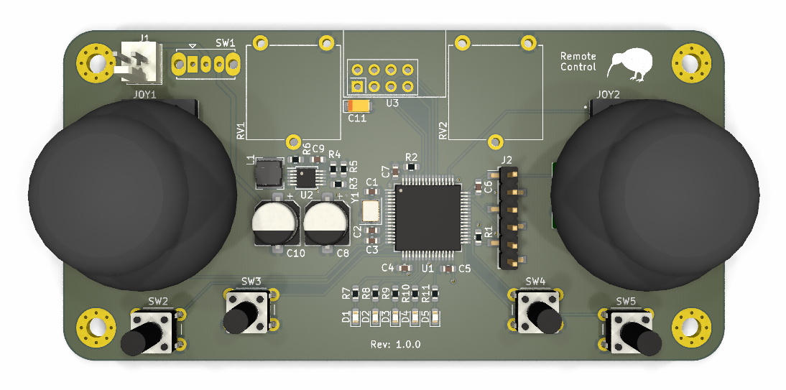
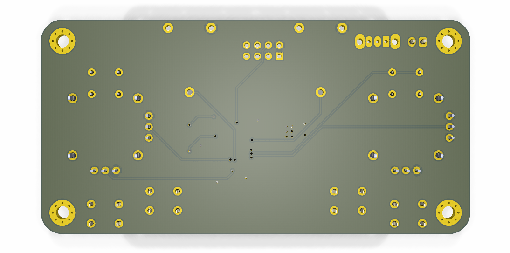

# RC Helicopter Remote

## Overview

This project is a custom PCB-based remote controller for an RC helicopter, built around the STM32L452RET6 microcontroller. It interfaces with two joysticks, four buttons, and two potentiometers to capture user input and transmits control data wirelessly via the NRF24L01 module to the helicopter's mainboard.

It complements the [Mainboard PCB](https://github.com/ikajdan/rc_helicopter_mainboard) and is developed in parallel with it as part of the same system.

## Features

The board features an STM32L452RET6 microcontroller, powered by a Li-Ion battery regulated to 3.3 V. It includes a 16 MHz crystal oscillator for accurate timing and clocking. Input devices such as two joysticks (X, Y, S), multiple buttons (SW1–SW4), and two analog potentiometers are connected directly to GPIO pins. Wireless communication is handled by the NRF24L01 module via SPI. Several status LEDs provide user feedback.

## PCB Design

This is a 2-layer compact PCB designed for handheld use, with easy access to controls and routing for digital and analog signals.

| Front View                            | Back View                           |
|---------------------------------------|-------------------------------------|
|  |  |

## Power Supply

The power supply uses an LTC3440 buck-boost converter to step the battery voltage down to 3.3 V. Key components include a 10 µH inductor, 22 µF output capacitor, and feedback resistors (R3 = 340 kΩ, R5 = 200 kΩ, R4 = 15 kΩ) to set the output voltage. The converter is configured for efficient operation across a wide input range and includes filtering components for stability. A power switch and 10 µF input capacitor (C10) are included for basic input protection and noise reduction.

## License

This project is licensed under the [CERN Open Hardware Licence Version 2 - Permissive (CERN-OHL-P)](https://ohwr.org/cern_ohl_p_v2.txt).
You are free to use, modify, and distribute this design, provided you retain notices and disclaimers as specified in the license terms. See the [LICENSE](LICENSE.md) file for full details.
